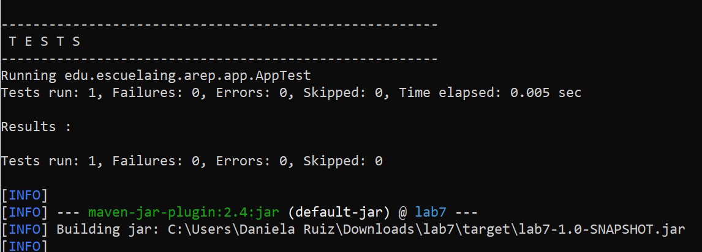
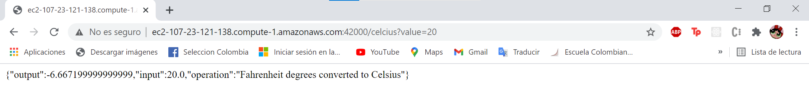
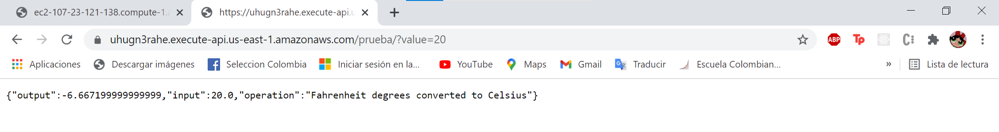
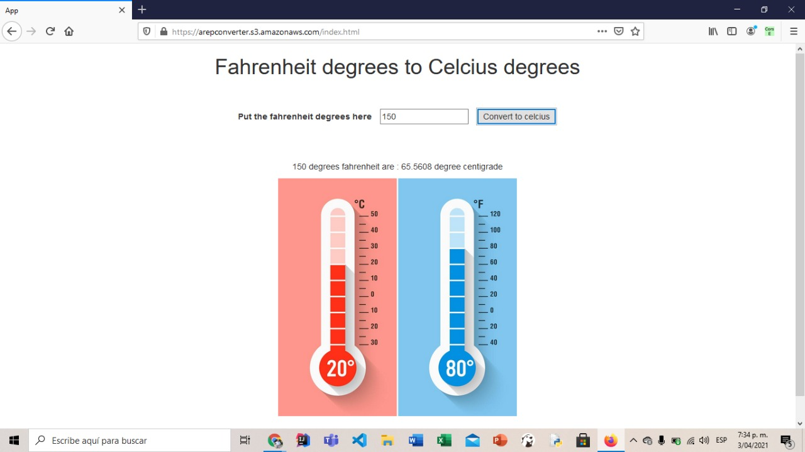

# LABORATORY - AMAZON GATEWAY AND LAMBDA. 🚀

## Escuela Colombiana de Ingeniería - Enterprise Architectures(AREP).

_In this laboratory we are going to create a Web service in Spark that converts degrees Fahrenheit into degrees Celcius and shows us the response in a JSON. Deployed the service on AWS EC2 and using getway API. All this through the creation of a JS application to use the service deploying it in S3._

## Getting Started

### Prerequisites

- [Maven](https://maven.apache.org/) - Dependency Management.

- [Java 8](https://www.oracle.com/co/java/technologies/javase/javase-jdk8-downloads.html) -  Development Environment.

- [Git](https://git-scm.com/) - Version Control System.

- [Spark](http://sparkjava.com/) - Micro framework for creating web applications in Java 8.


Make sure you have this programs installed correctly and the version that we need with the following commands:

```
mvn --version
```

```
git --version
```

```
java -showversion
```

### Installing

1. Clone the repository:

```
git clone https://github.com/angiedanielar/LAB7_AREP.git
```

2. Compile the projet:

```
mvn package
```

3. Executing the LOGIN program:

```
mvn exec:java -D "exec.mainClass"="edu.escuelaing.arep.app.App"
```

And put in your browser: https://localhost:5000


- Example to use: https://localhost:5000/celcius?value=20


4. Executing the SERVICE program:

```
mvn exec:java -D "exec.mainClass"="edu.escuelaing.arep.SparkWebApp"
```

5. Generating the documentation:

```
mvn javadoc:javadoc
```

## Tests



## Results









## Built With

- [Maven](https://maven.apache.org/) - Dependency Management

- [Java 8](https://www.oracle.com/co/java/technologies/javase/javase-jdk8-downloads.html) -  Development Environment.

- [Git](https://git-scm.com/) - Version Control System.

- [Spark](http://sparkjava.com/) - Micro framework for creating web applications in Java 8.

- [Latex](overleaf.com) - Text composition system.

## Author

- Angie Daniela Ruiz Alfonso.

## License

This project is under GNU General Public License - see the [LICENSE](LICENSE) file for details.
